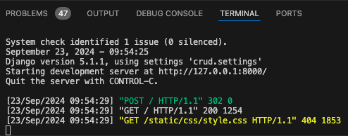
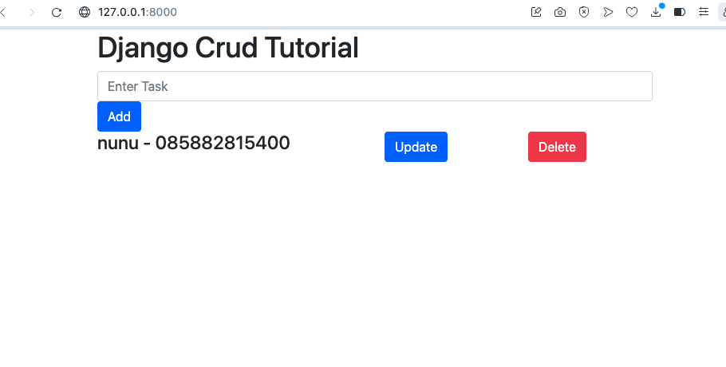

## Langkah menggunakan framework django

1. install Django

    ```
    pip install django
    ```
2. membuat core project python crud

    ```
    django-admin startproject crud 
    ```
3. membuat app Django

    ```
    python manage.py startapp crudapp
    ```
4. buka crud/settings.py tambahkan 'crudapp'

    ```
    INSTALLED_APPS = [
        'django.contrib.admin',
        'django.contrib.auth',
        'django.contrib.contenttypes',
        'django.contrib.sessions',
        'django.contrib.messages',
        'django.contrib.staticfiles',
    ]
    ```

    menjadi

    ```
    INSTALLED_APPS = [
        'django.contrib.admin',
        'django.contrib.auth',
        'django.contrib.contenttypes',
        'django.contrib.sessions',
        'django.contrib.messages',
        'django.contrib.staticfiles',
        'crudapp'
    ]
    ```
    dan jangan lupa tambahkan STATICFILES_DIRS = [BASE_DIR/'static'] dibawah STATIC_URL = 'static/' alhasil menjadi
    ```
    STATIC_URL = 'static/'
    STATICFILES_DIRS = [BASE_DIR/'static']
    ```
    

5. ubah crudapp/models.py

    ``` 
    from django.db import models
    ```

    menjadi

    ```
    from django.db import models

    # Create your models here.
    class Task(models.Model):
        title = models.CharField(max_length= 100)

        def __str__(self):
            return self.title
    ```
    kemudian makemigrations dengan cara 
    ```
    python manage.py makemigrations
    ```
6. ubah crud/urls.py

    dari
    ```
    from django.contrib import admin
    
    urlpatterns = [
        path('admin/', admin.site.urls),
        
    ]
    ```

    menjadi

    ```
    from django.contrib import admin
    from django.urls import path, include

    urlpatterns = [
        path('admin/', admin.site.urls),
        path('', include('crudapp.urls'))
    ]
    ```

7. buat urls.py didalam crudapp kemudian salin kode dibawah
    ```
    from django.urls import path
    from . import views

    urlpatterns = [
        path('', views.index, name='index'),
        path('update_task/<str:pk>', views.update, name = 'update'),
        path('delete_items/<str:pk>', views.delete, name = 'delete'),
    ]
    ```

8. ubah views.py yang ada didalam folder crudapp, trus copy aja sourcecode dibawah

    ```
    from django.shortcuts import render, redirect
    from .models import Task
    from .forms import TaskForm
    # Create your views here.


    def index(request):
        tasks = Task.objects.all()
        form = TaskForm()
        if request.method == 'POST':
            form = TaskForm(request.POST)
            if form.is_valid():
                form.save()
                return redirect('index')
        return render(request, 'index.html', {'tasks':tasks, 'form': form})

    def update(request, pk):
        task = Task.objects.get(id=pk)
        form = TaskForm(instance=task)
        if request.method == 'POST':
            form = TaskForm(request.POST, instance=task )
            if form.is_valid():
                form.save()
                return redirect('index')
        return render(request, 'update.html', {'task': task, 'form': form})

    def delete(request, pk):
        task = Task.objects.get(id=pk)
        if request.method == 'POST':
            task.delete()
            return redirect('index')
        return render(request, 'del.html', {'task':task})

    ```

8. coba lihat difolder crudapp ada file forms.py tidak ? kalo nggak ada buat, kalo ada ubah menjadi seperti code dibawah

    ```
    from django import forms
    from django.forms import ModelForm
    from .models import Task

    class TaskForm(forms.ModelForm):
        title = forms.CharField(max_length=100, widget=forms.TextInput(attrs={
            'class':'form-control', 'placeholder':"Enter Task"
        }))
        class Meta:
            model = Task
            fields = '__all__'
    ```

9. daftarin tuh modelnya, caranya ? buka folder crudapp cari file admin.py kalo nggak ada tinggal buat, copy code dibawah
    ```
    from django.contrib import admin

    # Register your models here.
    from .models import Task

    admin.site.register(Task)
    ```

10. buat folder templates didalam folder crudapp, kemudian buat file base.html, del.html, index.html, update.html untuk codenya dibawah yah

base.html
```
    <!DOCTYPE html>
    
    <html lang="en">
    <head>
        <meta charset="UTF-8">
        <meta http-equiv="X-UA-Compatible" content="IE=edge">
        <meta name="viewport" content="width=device-width, initial-scale=1.0">
        <link href="https://cdn.jsdelivr.net/npm/bootstrap@5.0.1/dist/css/bootstrap.min.css"        rel="stylesheet" integrity="sha384-+0n0xVW2eSR5OomGNYDnhzAbDsOXxcvSN1TPprVMTNDbiYZCxYbOOl7+AMvyTG2x" crossorigin="anonymous">
        <link rel = 'stylesheet' href = "">
        
        <title></title>
        
    </head>
        <body>
            
                <h1>Hello World</h1>
            
        </body>
    </html>

```

 del.html
 ```
 
    
    <div class = 'container'>
    <div class = 'row'>
    <div class = 'col-12'>
    <h4>Are you sure you want to delete "<strong>{{task}}</strong>"</h4></div>
    <div class = 'col-6'>
    <a href="" class = 'btn btn-primary'>Cancel</a></div>
    <div class = 'col-6'>
    <form method="POST">
        
    <input type = 'submit' value = 'Confirm' class = 'btn btn-danger'>
    </form>
    </div>
    </div>
    </div>
    
```

index.html
```


<title>Django Crud</title>




<div class="container">
<h1>Django Crud Tutorial</h1>

<form method="POST">

<div id = 'form-container'>
    {{form.title}}
    <input type = 'submit' value = 'Add' class = 'btn btn-primary'>
</div>

</form>

<div class = 'row'>

<div class = "col-6"><h4>{{task}}</h4></div>
<div class = "col-3"><a  class = 'btn btn-primary' href="">Update</a></div>
<div class = "col-3"><a class = 'btn btn-danger' href="">Delete</a></div>


</div>

</div>


```

update.html
```



<div class = 'container'>
<h1>Update Items</h1>
<form method="POST">
    
    <div id = 'form-container'>
    {{form.title}}
    <input type = 'submit' value = 'Update' class = 'btn btn-primary'>
</div>
</form>
</div>

```

kalo udah semua tinggal jalankan aplikasinya dengan cara 
```
python manage.py runserver
```



hasil 



